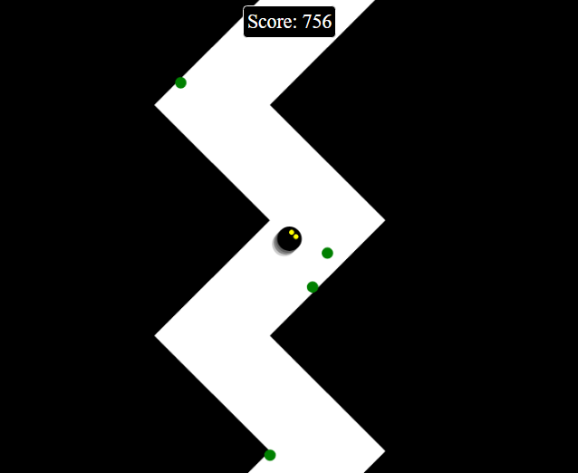

# Zig Zag Game

This is a simple Zig Zag game implemented in HTML (canvas) and JavaScript.

# Live host

Game hosted on https://alexisraspberry.duckdns.org/zigzag/

## Description

This project is a submission for Radu Mariescu-Istodor's video. The game involves controlling a player that moves along a zigzag path. The player can change direction by clicking/touching or pressing the spacebar. The objective is to stay on the path and score as many points as possible.

## How to Run

1. Clone the repository.
2. Open `index.html` in a web browser.
3. Click the "Start Game" button to begin playing.

## Things that can be improved:
- adjust speed to be equal in all devices (mobile, desktop)
- different rewards types
- better alignment when changing for different widths and heights
- sound effects

Enjoy the game!

